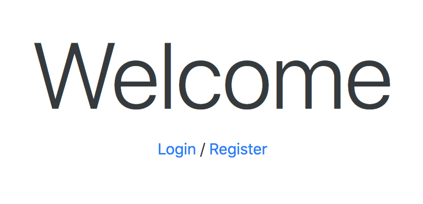

# Account Login (No Cookie)
使用者登入

## 安裝方式
- 將專案clone到本地端
`https://github.com/calvinsungvin/login_page.git`
- 進入專案資料夾，並下載package
`cd login_page` &
`npm install`
- 透過nodemon啟動專案
`npm run dev`
- 在terminal可以看到 Express is listening on localhost : 3000，開啟瀏覽器在網址列輸入localhost:3000

## 網站功能
1. 輸入特定使用者email及密碼，能夠登入，並看到使用者的first name 及 Email
2. 使用者可以註冊
3. 使用者可以登出

## 特定使用者的登入email及password
| Plugin | README |
| ------ | ------ |
| tony@stark.com | iamironman |
| captain@hotmail.com | icandothisallday |
| peter@parker.com | enajyram |
| natasha@gamil.com | *parol#@$! |
| nick@shield.com | password |

## 開發環境
1. Node.js v10.15.0
2. Express v4.17.1
3. Express-Handlebars v4.0.4
4. Body-parser: v1.19.0

## 截圖

